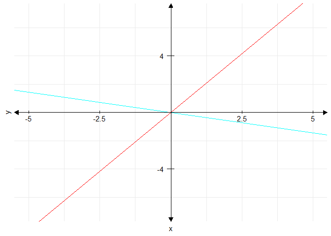

<!-- README.md is generated from README.Rmd. Please edit that file -->

# matador

<!-- badges: start -->
<!-- badges: end -->

matador is a simple package intended for plotting and working with
matrices. It is intended to help students complete typical linear
algebra problems using Rmarkdown.

## Installation

matador depends on several of the core tidyverse packages, namely purrr,
dplyr, and ggplot2, as well as the ggplot2 extension cowplot.

## Examples

Here are a few demonstrations of matador’s functionality:

matador makes it easy to visualize two-dimensional linear
transformations:

``` r
library(matador)
#> Loading required package: magrittr
ggplot2::theme_set(ggplot2::theme_minimal())
plot_transform(trans = matrix(c(-1, 1,1, -1), nrow =2))
```


You can do the same for systems of equations:

``` r
plot_lines(m = matrix(c(-5, 2, 3, 7), nrow =2))
```



Or easily compute arbitrary powers of matrices:

``` r
mat_pows(matrix(1:9, nrow = 3), 1:5)
#> $`1`
#>      [,1] [,2] [,3]
#> [1,]    1    4    7
#> [2,]    2    5    8
#> [3,]    3    6    9
#> 
#> $`2`
#>      [,1] [,2] [,3]
#> [1,]   30   66  102
#> [2,]   36   81  126
#> [3,]   42   96  150
#> 
#> $`3`
#>      [,1] [,2] [,3]
#> [1,]  468 1062 1656
#> [2,]  576 1305 2034
#> [3,]  684 1548 2412
#> 
#> $`4`
#>       [,1]  [,2]  [,3]
#> [1,]  7560 17118 26676
#> [2,]  9288 21033 32778
#> [3,] 11016 24948 38880
#> 
#> $`5`
#>        [,1]   [,2]   [,3]
#> [1,] 121824 275886 429948
#> [2,] 149688 338985 528282
#> [3,] 177552 402084 626616
```

Or even display the orthogonal decomposition of a matrix:

``` r
plot_decomposition(square(1, 2, 3, 4))
```


For more details, take a look at the package vignette.

## Acknowledgments

This package could not have been developed without the invaluable
[devtools](https://cran.r-project.org/web/packages/devtools/index.html)
package, which simplifies and automates the process of package
development.

`make_axes` benefited greatly from
[this](https://stackoverflow.com/questions/17753101/center-x-and-y-axis-with-ggplot2)
StackOverflow exchange.

Documentation for `vec_helpers` drew on
[this](https://stackoverflow.com/questions/15932585/multiple-functions-in-one-rd-file)
resource.

`print_eqn` was inspired by
[this](https://stackoverflow.com/questions/30879083/make-r-markdown-code-blocks-into-math-mode)
StackOverflow post.

My primary linear algebra resource was Otto Bretscher’s *Linear Algebra
with Applications* (5th ed.).

Professor Joshua Lansky’s linear algebra course inspired this package
and gave me the knowledge in linear algebra to complete it.
